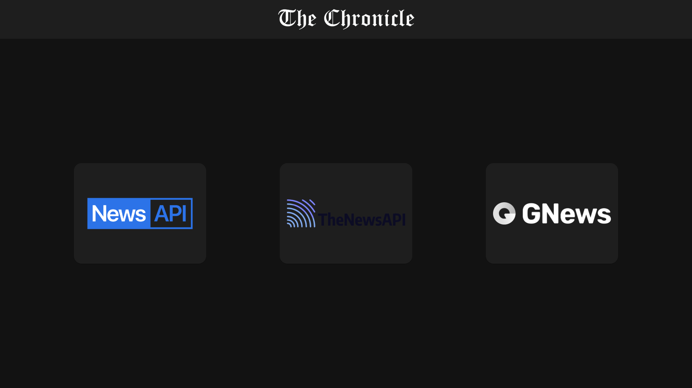

# The Chronicle

This is a modern and clean news web application that allows users to fetch and view the latest news from three different APIs. The app provides a dynamic, responsive interface with support for both light and dark themes.

## Features

- Fetches news from the following APIs:
  1. **NewsAPI** ([newsapi.org](https://newsapi.org/))
  2. **TheNewsAPI** ([thenewsapi.com](https://thenewsapi.com/))
  3. **GNewsAPI** ([gnews.io](https://gnews.io/))
- Provides a simple user interface with options to choose between the APIs.
- Clean and modern design that supports both dark and light themes.
- Responsive design that adapts to mobile, tablet, and desktop devices.

## Screenshots

### 1. **Home Route (`/`)**: Choose Your API

This page allows users to select which API they want to use to fetch news.



### 2. **News Dashboard**: Displaying News

Here, you can view news articles fetched from the selected API. The cards display the article's title, description, publication time, and author.


## Installation

To set up and run the application locally, follow these steps:

### Prerequisites
- [Node.js](https://nodejs.org/en/download/) installed (v14+ recommended)
- A code editor like [VS Code](https://code.visualstudio.com/)

### Steps
1. **Clone the repository:**
   ```bash
   git clone https://github.com/sapekshpareek/Chronicle.git
   cd Chronicle
   ```

2. **Install dependencies:**
   ```bash
   npm install
   ```

3. **Set up your API keys:**

   - **NewsAPI**: Go to [newsapi.org](https://newsapi.org/) and sign up for an API key.
   - **TheNewsAPI**: Go to [thenewsapi.com](https://thenewsapi.com/) and get an API key.
   - **GNewsAPI**: Visit [gnews.io](https://gnews.io/) and obtain your API key.

   After obtaining the API keys, create a `.env` file in the root of your project and add the following:

   ```
    VITE_GNEWS_API = "your_gnewsapi_key"
    VITE_NEWS_ORG_API = "your_newsapi_key"
    VITE_THE_NEWS_API = "your_thenewsapi_key"
   ```

4. **Run the app:**
   ```bash
   npm start
   ```

   The app will be available at `http://localhost:3000/`.

## How to Use

1. **Choose an API**: On the home route (`/`), you can select which API you'd like to fetch news from.
2. **View News**: Once an API is selected, the news dashboard will display the latest headlines fetched from the chosen API.
3. **Theme Toggle**: You can switch between dark and light themes by using the theme toggle button.

## Dependencies

This project uses the following dependencies:

- **React**: JavaScript library for building user interfaces.
- **Material-UI**: React components for faster and easier web development.
- **Fetch**: Promise-based HTTP client for the browser and Node.js.
- **React Router**: Declarative routing for React.

## Development

To contribute to this project or to run it in a development environment, follow the instructions in the "Installation" section above.

### Customization

You can easily customize the UI, API selection, or theme to suit your needs. For example, to change the layout or add more APIs, simply modify the relevant components in the `/src/components` directory.

## License

This project is licensed under the MIT License - see the [LICENSE](LICENSE) file for details.
